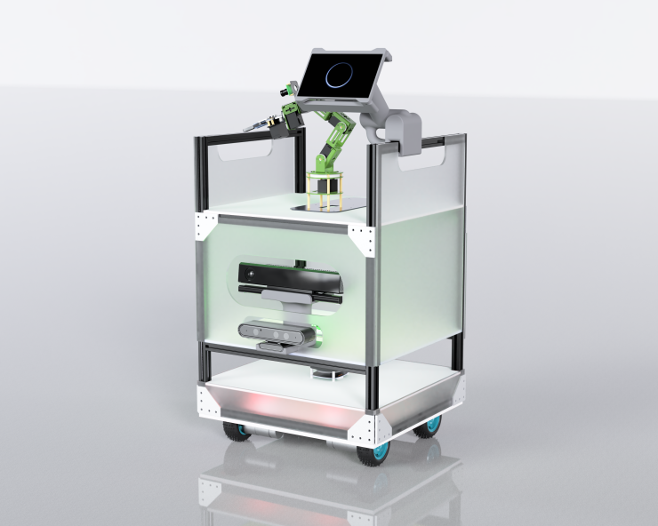

# AMAR: A Cutting-Edge Medical Assistant Robot

In the ever-changing world of healthcare, the incorporation of cutting-edge robotics has the power to completely transform the way patients are treated and how operations are carried out. **AMAR**, a state-of-the-art medical assistant robot, showcases this immense potential for transformation.

## Key Features of AMAR

**AMAR** is designed to navigate hospital environments effortlessly, utilizing advanced technologies to carry out essential tasks such as:
- **Patient Monitoring**
- **Medicine Distribution**
- **Transfer of Medical Supplies**

## ROS Navigation Stack

At the core of AMAR's navigation capabilities lies the **ROS (Robot Operating System) Navigation Stack**, which includes a wide range of software packages that manage:
- **Localization**
- **Mapping**
- **Odometry**
- **Path Planning**

This system allows **AMAR** to navigate intricate indoor environments with exceptional accuracy and reliability.

### 2D SLAM Technology
AMAR utilizes **2D SLAM** (Simultaneous Localization and Mapping) technology to:
- Create detailed maps of its surroundings
- Accurately determine its position within those maps

### Global and Local Planning
Equipped with the **Global Planner** and **Teb Local Planner** from the ROS navigation stack, AMAR navigates through dynamic and obstacle-rich environments safely and efficiently.

## Document Overview

This document explores the various elements of AMAR's design and functionality:

1. **Literature Review**:
   - Provides a comprehensive understanding of AMAR’s role in medical robotics, offering context and background from existing research.

2. **Design Considerations**:
   - Explores the unique aspects of AMAR’s navigation capabilities, including methodologies for calculating:
     - Odometry
     - Mapping
     - Localization
     - Path Planning

3. **Results**:
   - Evaluates AMAR's performance in a healthcare setting, showcasing its ability to:
     - Create intricate maps
     - Achieve precise localization
     - Execute efficient path planning

4. **Conclusion**:
   - Highlights the current capabilities of AMAR and discusses potential future advancements to improve its effectiveness in medical environments.

## Impact on Healthcare

This document emphasizes the profound impact that **advanced robotics** like AMAR can have on healthcare delivery. By improving **patient outcomes** and increasing **operational efficiency**, AMAR stands at the forefront of healthcare innovation.

---

**Note**: This repository contains detailed technical documents, code snippets, and configurations relevant to AMAR's development and implementation.

